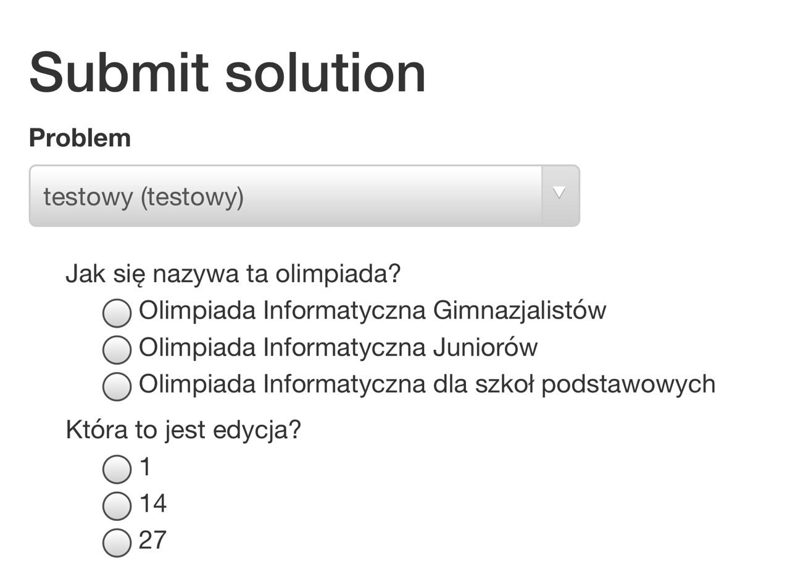
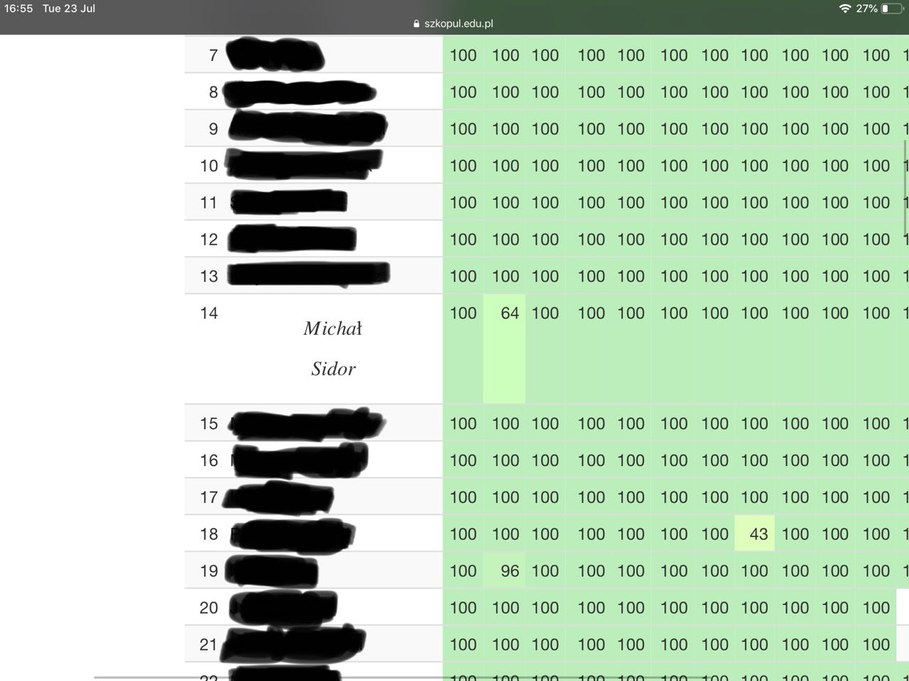

+++
title = "Adventures in SIO2: the many ways to add LaTeX to quizzes"
date = "2019-07-23T17:21:10+0200"
+++
[SIO2](https://github.com/sio2project/oioioi) is Polish Olympiad in Informatics's automatic grader (the insider term, I hear, is "online judge") for competitive programming contests. If you wanna try it out, I recommend the Olympiad-run public instance for training, [Szkopuł](https://szkopul.edu.pl).

But SIO2 is not just about submitting code solutions. The internal APIs are abstract enough to support, for example, quiz type contests.



They haven't seen much use over they years, though. But quizzes have always been a heavy part of the Polish Junior High School Olympiad in Informatics, and while the junior high schools are gone now following an (in my opinion) awful education system reform, some of the tradition is to be continued by Polish Junior Olympiad in Informatics, now for primary schools.

Now, I have no idea what the quiz questions may be about, and I can't find out what they were in the past, but what good is a competitive programming quiz without a mention of Big O notation for asymptotic complexity? And you can't just write it like O(n) or something, because it doesn't look math enough - you need proper rendering of math formulas.

Adding math to a web page is, hopefully, a long solved problem. It is year 2019, so all major browsers have probably implemented MathML, the W3C standard notation that Firefox fully supports since version 4? Nope, [Chrome supported it for one version 50 versions ago and decided it was incomplete and dropped it](https://caniuse.com/#search=mathml). And MathML never caught on either way.

There is, however, another notation that is decades old and well known - LaTeX. Of course, this is not to say anyone knows how to make a document written in LaTeX look actually good, but at least it is a standard way of writing math formulas.

Now, since the quizzes consist only of single or multiple choice questions statically defined by the author, and the contestant will never have to actually write LaTeX, there is no need to bring full LaTeX renderer into the web page. However, it might be the most common option.

First, let's take a look at how quiz questions are turned from database tables into HTML radio buttons or checkboxes. SIO2 was coded up using Django, a popular model-view-controller framework for Python. Quiz support is added by the package named `oioioi.quizzes`. But as you can see, there is not a single view defined in that package. Instead, an abstraction layer provided by `oioioi.problems` is used, a `ProblemController`. It is a base class shared by quizzes and programming tasks. When a user tries to submit a solution for a problem, a page is generated using Django's forms framework. Subclasses are then given the opportunity to modify the form as it is generated, for example to add more fields. [`QuizProblemController` uses this](https://github.com/sio2project/oioioi/blob/1f9040c95acf7c70936b4e0c0f8f74d6eb6b6c1c/oioioi/quizzes/controllers.py#L46-L67) to add a field for each question in the quiz:

```python
    def adjust_submission_form(self, request, form, problem_instance):
        questions = problem_instance.problem.quiz.quizquestion_set.all()

        for question in questions:
            answers = question.quizanswer_set.values_list('id', 'answer')
            field_name = self._form_field_id_for_question(problem_instance,
                                                          question)
            if question.is_multiple_choice:
                form.fields[field_name] = forms.MultipleChoiceField(
                    label=question.question,
                    choices=answers,
                    widget=forms.CheckboxSelectMultiple,
                    required=False
                )
            else:
                form.fields[field_name] = forms.ChoiceField(
                    label=question.question,
                    choices=answers,
                    widget=forms.RadioSelect,
                    required=False
                )
            form.set_custom_field_attributes(field_name, problem_instance)
```

The extensive use of Django forms and Django admin panel throughout SIO2 makes it much faster to create user interfaces for new data models, but it is a double-edged sword.

Consider the options we have for rendering LaTeX. We could do this all server-side and provide user with an image. That seems bad for accessibility, because an image alone carries no semantic information about its contents. Therefore it might be better to render it client-side instead. Client-side rendering could still be problematic for users without JavaScript support, but I am afraid the interface is already hard to use for them, and I think plain text LaTeX formulas are still quite readable.

There are two major LaTeX implementations for browsers: [MathJax](https://mathjax.org) and [KaTeX](https://katex.org).

MathJax is industry standard at this point. I've seen it used on my faculty's websites and many other places. It is compatible with IE6 if you tell it to, and it says it's accessible. Meanwhile KaTeX is a Khan Academy project taking pride in being faster at rendering things than MathJax.

My work laptop is a Pinebook and my gaming laptop is powered by a 9 year old Intel Atom CPU, so I naturally flock to faster solutions that eat less CPU.

Initially I was also misled in favour of KaTeX by the differences in the usage: by default MathJax automatically renders all LaTeX found in the page content, while KaTeX is just a library with a function that creates DOM elements from a given LaTeX string, with an additional extension which renders all LaTeX found in a DOM element given to it. Therefore I was more interested in adding special classes to the quiz questions which contain math formulas and selectively render them with KaTeX. This, I thought, was a solution less vulnerable to user generated content. I mean, surely we wouldn't want users to put LaTeX in their full names, as LaTeX is a Turing complete language, and then render it in users' browsers?

I've already found out how to add extra classes to form elements. To be fair to MathJax, I did more research and found out there was a way to tell it to render selectively. Still, I chose KaTeX for no particular reason.

Before finally sitting down to implement it, just to make sure there isn't a MathJax in the codebase (it would be bad to have a possibility of both MathJax and KaTeX appearing on the same page, I guess), I search the codebase for MathJax. Then I wipe my glasses and look again. Then I remember that time four guys placed XSS in a ranking by landing four consecutive spots in a contest and then changing their full names (big thank you to [Krzysztof Ciebiera](https://mimuw.edu.pl/~ciebie/) for telling this anecdote during a Web Applications lecture I attended).

Now I am left to wonder how full is the implementation of LaTeX in MathJax:


